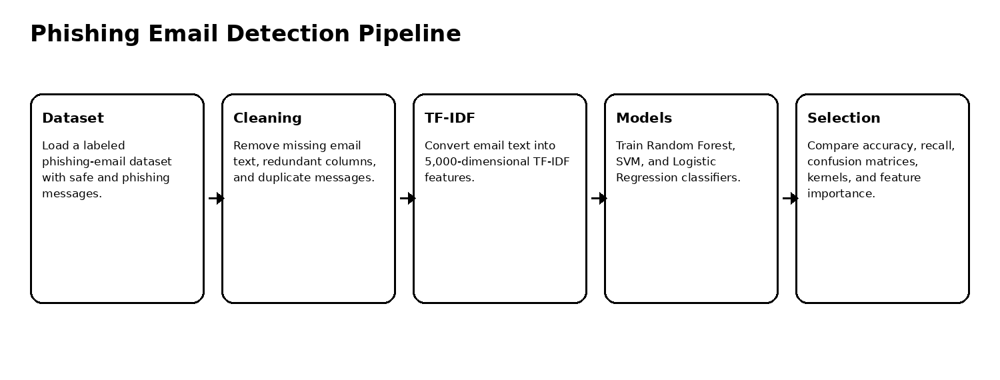
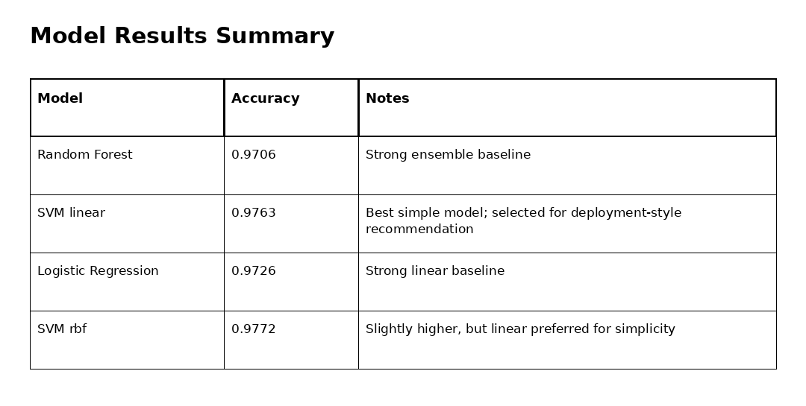
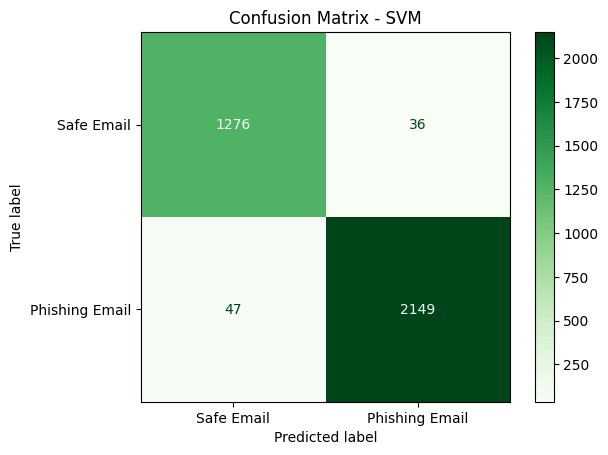
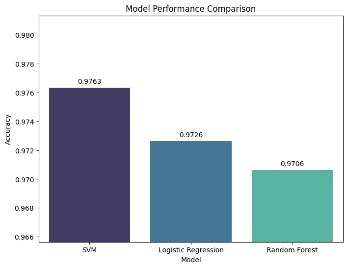
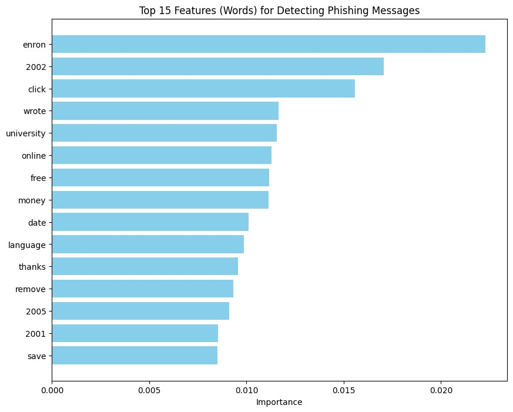

# Phishing Email Detection with Machine Learning

Machine learning workflow for phishing email detection using TF-IDF text features, Random Forest, Support Vector Machine, and Logistic Regression.

## Overview

This project builds and evaluates an AI-assisted phishing email detection pipeline. The goal is to classify email messages as **Safe Email** or **Phishing Email** using real labeled data and classical machine learning models.

The workflow emphasizes practical cybersecurity evaluation: not only overall accuracy, but also phishing recall, false positives, model comparison, kernel optimization, and feature importance.

## Dataset

| Item | Value |
|---|---:|
| Raw rows | 18,650 |
| Rows after cleaning | 17,538 |
| Original columns | Email Text, Email Type, redundant index column |
| Safe emails before cleaning | 11,322 |
| Phishing emails before cleaning | 7,328 |
| Missing email-text rows removed | 16 |
| Duplicate rows removed | 1,096 |
| Train/test split | 80% / 20% |
| TF-IDF features | 5,000 |
| Test samples | 3,508 |

## Pipeline



## Models Evaluated

| Model | Accuracy | Precision / Recall insight |
|---|---:|---|
| Random Forest | 0.9706 | Strong baseline with balanced phishing detection |
| Support Vector Machine | 0.9763 | Best selected model with high phishing recall |
| Logistic Regression | 0.9726 | Strong linear baseline |
| SVM with RBF kernel | 0.9772 | Slightly higher accuracy, but linear SVM remains simpler and easier to interpret |



## Selected Model

The SVM model was selected as the preferred model because it achieved the best balance between high accuracy, phishing recall, and operational simplicity.

For the linear SVM:

| Class | Precision | Recall | F1-score |
|---|---:|---:|---:|
| Safe Email | 0.96 | 0.97 | 0.97 |
| Phishing Email | 0.98 | 0.98 | 0.98 |



## Model Comparison and Feature Analysis

| Model performance comparison | Top phishing-related terms |
|---|---|
|  |  |

The feature-importance analysis highlighted terms such as `click`, `free`, `money`, and `online`, which are consistent with common phishing and social-engineering patterns. Some dataset-specific terms also appeared, which is a useful reminder that feature importance should be interpreted with domain awareness.

## Key Findings

1. TF-IDF features were effective for representing email text in a classical ML pipeline.
2. All three models achieved strong performance above 97% accuracy.
3. SVM achieved the strongest selected performance with 97.63% accuracy.
4. RBF SVM slightly improved accuracy to 97.72%, but linear SVM was preferred for simplicity.
5. The best model detected about 98% of phishing emails in the test set.
6. Feature importance revealed both phishing-style cues and dataset-specific terms.
7. The remaining errors show that phishing detection should still be monitored and periodically retrained.

## Repository Contents

```text
.
├── phishing_email_detection_ml.ipynb
├── docs/
│   └── figures/
├── requirements.txt
├── .gitignore
└── README.md
```

## Run Locally

This repository is notebook-based. Create a clean Python environment, install the dependencies, then open the notebook.

### Windows PowerShell

```powershell
py -3.10 -m venv .venv
.\.venv\Scripts\Activate.ps1
python -m pip install --upgrade pip
pip install -r requirements.txt
```

### Linux / macOS

```bash
python3 -m venv .venv
source .venv/bin/activate
python -m pip install --upgrade pip
pip install -r requirements.txt
```


## Open the Notebook

```bash
jupyter notebook phishing_email_detection_ml.ipynb
```

## Notes

The raw dataset is not included in this repository. Place the dataset file at `data/Phishing_Email.csv` before running the notebook locally.
